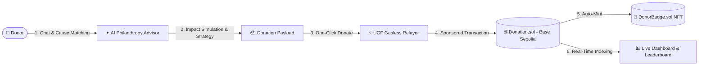

# 🌿 ChainCare — AI-Powered Humanitarian Giving Platform

[](https://sepolia.basescan.org)
[](https://universalgasframework.com)
[](https://anthropic.com)
[](LICENSE)

> **Empowering purposeful philanthropy through conversational AI guidance, zero-gas transactions, and verifiable on-chain impact.**

---

## 🌟 Overview

**ChainCare** is a Web3 humanitarian giving platform built on **Base Sepolia**. It bridges donors and verified humanitarian causes by combining:
1. **✦ AI Philanthropy Advisor**: Conversational guidance, real-world impact projections, and automated recurring giving plans.
2. **⚡ 100% Gasless Donations**: Powered by Universal Gas Framework (UGF) — donors only need test tokens without ever paying ETH for gas fees.
3. **🏅 On-Chain NFT Donor Badges**: Dynamic ERC-721 donor badges minted automatically with on-chain metadata and tiered rewards.
4. **📊 Real-Time Transparency**: Fully audited on-chain donor ledger, live campaign progress bars, and community leaderboards.

---

## 🏗️ Architecture & Workflow



---

## ✨ Key Features

### ✦ 1. AI Philanthropy Advisor (`/advisor`)
* **Contextual Cause Recommendation**: Understands natural language donor preferences (*hunger relief, education, animal welfare, disaster response*).
* **Granular Impact Simulation**: Translates raw currency into tangible human outcomes (e.g., *25 TYI = 20 family meals or 1 emergency ration kit*).
* **Autonomous Giving Plans**: Design customized recurring donation strategies (*weekly, bi-weekly, monthly*) stored client-side.
* **Dual-Engine Execution**: Seamlessly connects to **Claude (claude-sonnet-4-20250514)** with a built-in deterministic fallback engine for offline reliability.

### ⚡ 2. Universal Gas Framework (UGF) Integration
* **Zero Gas Hassle**: Eliminates the barrier of acquiring native testnet ETH for transaction fees.
* **Streamlined 4-Step Pipeline**:
  1. *Quoting*: Dynamic gas quote fetched remotely via `@tychilabs/ugf-testnet-js`.
  2. *Authorization*: One-signature token authorization (`TYI_USD_PAYMENT_COIN`).
  3. *Sponsorship*: UGF sponsors the execution digest.
  4. *On-Chain Settlement*: Transaction broadcast directly to Base Sepolia.

### 🏅 3. Dynamic On-Chain NFT Badges (`/badges`)
* Automatically mints verifiable **ERC-721** badges on every confirmed donation.
* Fully on-chain JSON + Base64 encoded metadata without reliance on external IPFS pinning.
* **Tier Thresholds**:
  - 🥉 **Bronze**: `< 50 TYI`
  - 🥈 **Silver**: `50 – 99 TYI`
  - 🥇 **Gold**: `100+ TYI`

---

## 🧭 Application Routes

| Route | Page | Purpose |
|---|---|---|
| `/` | **Landing Page** | Platform introduction, impact statistics, and mission overview |
| `/advisor` | **✦ AI Philanthropy Advisor** | Interactive AI advisor chat, impact calculator & plan builder |
| `/dashboard` | **NGO Dashboard** | Browse active humanitarian campaigns & donate gaslessly |
| `/history` | **Donation History** | Live on-chain transparency table indexed from Base Sepolia |
| `/leaderboard` | **Donor Leaderboard** | Top contributors ranked with podium recognition |
| `/badges` | **My Badges** | Personal NFT trophy room of on-chain donor credentials |

---

## 🛠️ Tech Stack

* **Frontend**: React 19, Vite, React Router v7, Vanilla CSS Design System
* **Web3 Integration**: Ethers.js v6, `@tychilabs/ugf-testnet-js`
* **Smart Contracts**: Solidity ^0.8.20, OpenZeppelin Contracts
* **AI Engine**: Anthropic Claude API (`claude-sonnet-4-20250514`) + Custom Local Fallback Engine
* **Network**: Base Sepolia Testnet (Chain ID: `84532`)

---

## 🚀 Getting Started

### 1. Prerequisites
- **Node.js** (v18 or higher)
- **MetaMask** or any EVM-compatible browser wallet connected to **Base Sepolia**.

### 2. Installation
```bash
# Clone repository
git clone https://github.com/Smitakalluri15/chaincare.git
cd chaincare

# Install dependencies
npm install
```

### 3. Environment Configuration
Copy the template `.env.example` into `.env`:
```bash
cp .env.example .env
```

Ensure your `.env` contains the deployment configuration:
```env
VITE_BASE_SEPOLIA_CHAIN_ID=84532
VITE_BASE_SEPOLIA_RPC=https://sepolia.base.org
VITE_DONATION_CONTRACT=0xcD78Daa7f9d7F3DfEFC53df89FED946d0712DA5a
VITE_BADGE_CONTRACT=0xe2f1D9755aBB7421D8E2257C4C3061d713d95642
VITE_TYI_TOKEN_ADDRESS=
VITE_DONATION_START_BLOCK=

# Optional Anthropic Claude API Key (built-in intelligent advisor active by default)
VITE_ANTHROPIC_API_KEY=
```

### 4. Development Server
```bash
npm run dev
```
Open [http://localhost:5173](http://localhost:5173) in your browser.

### 5. Production Build
```bash
npm run build
npm run preview
```

---

## ⛓️ Smart Contracts (Base Sepolia)

| Contract | Address | Explorer Link |
|---|---|---|
| **Donation.sol** | `0xcD78Daa7f9d7F3DfEFC53df89FED946d0712DA5a` | [View on BaseScan](https://sepolia.basescan.org/address/0xcD78Daa7f9d7F3DfEFC53df89FED946d0712DA5a) |
| **DonorBadge.sol** | `0xe2f1D9755aBB7421D8E2257C4C3061d713d95642` | [View on BaseScan](https://sepolia.basescan.org/address/0xe2f1D9755aBB7421D8E2257C4C3061d713d95642) |

---

## 🔒 Security & Privacy

* **Zero Private Key Exposure**: Private keys and sensitive tokens are strictly ignored from source control via `.gitignore`.
* **Safe Client Architecture**: All transactions require explicit wallet confirmation from the donor's MetaMask/Browser provider.
* **On-Chain Immutability**: All donation receipts and badge ownership records are permanently etched on the Base Sepolia ledger.

---

## 📄 License

This project is licensed under the [MIT License](LICENSE).

---

<div align="center">
  Built with ❤️ for the <strong>UGF Hackathon</strong> · Powered by <strong>Base Sepolia</strong>, <strong>UGF</strong> & <strong>Claude AI</strong>
</div>
